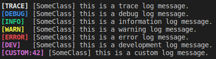

# Bragi

Version 1.0.0

Bragi is a minimal C++ logging framework.

## framework features

* __ideal release performance:__ when Logging is turned off completely, or a message is below the cutoff level, zero computational overhead is generated, when compiling in release mode.
* __thread safety:__ different threads can log to the system, without intermingling the messages provided with the stream operator.
* __minimal:__ this is meant to provide a minimal but complete logging framework, with next to no code bloating.
* __log to file or console:__ the system can either print to a specified file or to the console (via ```std::cerr```).
* __logging levels:__ the framework provides different logging levels for each message.
* __global cutoff level:__ this enables the user to decide to what level of detail the system should print.
* __local cutoff level:__ this overrides the global cutoff level, and provides more flexibility.
* __stream operator:__ the system is set up to log any message-type for which an overload for ```std::ostream::operator<<``` is defined.
* __scope specific configuration:__ logging for individual scopes can easily be switched on or off, or otherwise configured.
* __log level prefix:__ The log level of each message is printed always before each message.
* __source class prefix:__ the logging system is able to provide the class name, from where the logging is called, in squared brackets as a prefix to each message.

<br />

## system specifics

* C++14 is the minimum required standard.
* compiles with clang 9.0, gcc 7.4, gcc 9.0 with warning flags: -Wall, -Wextra, & -Wpedantic
* compiles with MSVC with warning flags: -W4, /wd4127

<br />

## appearance

The default (= colored console) output looks like this:\
\
[TRACE], [DEBUG], [INFO], [WARN], [ERROR], [DEV], [CUSTOM:X] are the log level prefixes, these are printed always. [SomeClass] is the source class prefix, it is only printed if provided. The rest is the logging message body.

<div style="page-break-after: always;"></div>

## usage of the framework

First step: include the header _bragi_.

### minimal

If you want to use only the barebone features of this library the only thing to do is call the macro ```BRAGI_INIT()``` within the scope you intend to use the logging functions.

After that you can use the other provided macros:
* ```LOG_TRACE```
* ```LOG_DEBUG```
* ```LOG_EVAL```
* ```LOG_INFO```
* ```LOG_WARN```
* ```LOG_ERROR```
* ```LOG_DEV```

in the same way you would use ```std::cout```, for example:

```cpp
#include "bragi"

BRAGI_INIT()

int main()
{
  LOG_INFO << "Hello World!\n";
}
```

Refer to _exampleProject/hello_world.cpp_.

### extended features

For now: refer to _exampleProject/example.cpp_.

<br />

## future features

* A more detailled usage description of the extended features.
* Messages without printed Log Level prefix.
* parallel logging with console and file.
* automatic testing.
